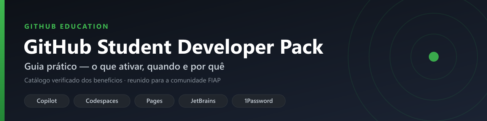

<!-- Badges: confirme o slug do repositório (owner/repo) se ele for diferente de wilamis-brasil/guia-beneficios-fiap -->

Material organizado sobre o **[GitHub Student Developer Pack](https://education.github.com/pack)**, do GitHub Education: contexto, passo a passo de solicitação, sugestões do que ativar primeiro, um catálogo de consulta com o que cada benefício realmente entrega e recursos complementares (links, canais e um bookmarklet de leitura em voz). Reunido originalmente para a comunidade FIAP.

> **Última atualização:** 22/06/2026

## 📄 O que tem neste repositório

| Documento | Em poucas palavras |
| --- | --- |
| [1. Guia principal](docs/01-github-student-pack.md) | O que é o Pack, requisitos, como solicitar e o que vale ativar primeiro. |
| [2. Catálogo](docs/02-pack-catalog.md) | Todos os benefícios por categoria, com o que cada um entrega e quando ativar. |
| [3. Recursos complementares](docs/03-bonus-resources.md) | Biblioteca de livros, canais, roadmap e o bookmarklet de leitura em voz. |

Índice detalhado da pasta `docs/`, com ordem de leitura e tempo médio: [docs/README.md](docs/README.md).

## 🧭 Antes de ativar tudo

- Leia o **guia principal** antes de sair ativando benefícios.
- Ative **só** o que conversa com o que você estuda ou constrói **agora**.
- Os valores em R$ citados são **estimativas ilustrativas** de economia potencial — dependem do uso e mudam com o tempo.
- Confira no [catálogo oficial do Pack](https://education.github.com/pack) antes de resgatar — ofertas e prazos mudam sem aviso.

## 🤝 Contribuir

Issues e pull requests para correções e melhorias são bem-vindos. Veja o [guia de contribuição](CONTRIBUTING.md).

Para apoiar o trabalho por trás deste e de outros projetos open source, há uma página no [GitHub Sponsors](https://github.com/sponsors/wilamis-brasil).

## ⚖️ Licença

Conteúdo (textos e materiais) sob [CC BY 4.0](LICENSE); código (pasta `scripts/`) sob [MIT](LICENSE-CODE). © 2026 Wilamis Brasil.

Ao reutilizar ou republicar este material, **é obrigatório dar crédito** — nome do autor e link para o repositório ou para a licença. Detalhes em [LICENSE](LICENSE).

Se o guia foi útil, deixar uma estrela ajuda outras pessoas a encontrá-lo.
